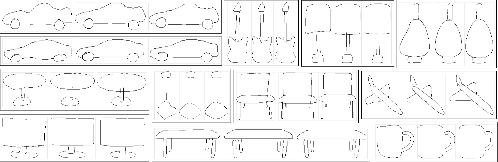

# Sketch Beautification: Learning Part Beautification and Structure Refinement for Sketches of Man-made Objects



> [Deng Yu](https://dengyuhk.github.io/), [Manfred Lau](https://www.scm.cityu.edu.hk/people/lau-chung-man-manfred), [Lin Gao](https://geometrylearning.com/lin/), [Hongbo Fu](https://sweb.cityu.edu.hk/hongbofu/)
>
> [[Paper]](https://arxiv.org/abs/2306.05832) [[Project Page]](https://dengyuhk.github.io/SketchBeautification/) [[Dataset]](#Dataset) [[Video]](https://www.youtube.com/watch?v=npL3IZSO_YE&t=7s)
>
> Accepted by IEEE TVCG 2023

## Prerequisites

Python version:

**python 3.6.9**

Clone this repository and install the dependent libraries (virtual environment recommended):

```bash
git clone https://github.com/dengyuhk/SketchBeautification.git
cd SketchBeautification

pip install virtualenv
virtualenv skbeauty_venv -p /usr/bin/python3.6

source skbeauty_venv/bin/activate
pip install -r requirements.txt
```

## Getting Started

### Pretrained Models

Please download our [pretrained models](https://drive.google.com/file/d/1FECRj0k9ktjnUyL0zpLA0-FJOWzvY4LB/view?usp=sharing), put them into the **parent directory** of this project (`SketchBeautification`), and extract them there.

```bash
cd SketchBeautification
cd .. #go to its parent directory

## todo: copy the trained_models to this folder and extract them here
```

### Code books

Please download our prepared [code_books](https://drive.google.com/file/d/1-PyNf1bXXjQxSj6WJ_EMjB44PlNVTOqq/view?usp=sharing) for all part sketches in our dataset in the **retrieval-and-interpolation** task and put it into `part_retrieval` folder.

### Fast Testing

If you only want to fast test some results using the pretrained models, you can directly run the below command to test the samples in the `sequence` folder. The testing consists of two stages and produce the final results in the `output` folder.

```bash
## A full pipeline 
python sketch_beautification_pipeline.py # beautify the user's freehand sketches via part geometry beautification and global structure refinement.
```

### Dataset

You can download our created [dataset](https://drive.google.com/file/d/1L-EisRMcpN3bUGb40PrZ7KkVOmGmyfAR/view?usp=sharing), put them into the **parent directory** of this project (`SketchBeautification`), and extract them to `data` folder for further training and testing. 

### Network Training

You can fine-tune and test each stage of our networks (Sketch Retrieval-and-Interpolation and Sketch Assembly) using the scripts:

### 1. Part Sketch Retrieval-and-Interpolation

```bash
# First step: train Sketch Implicit representation
python p_searchInte_module/train_sk_implict.py # Sketch Implict Representations

# Second step: construct the code book for retrieval-and-interpolation (choose one of the below methods)
python p_searchInte_module/code_generaion/latent_and_im_generation.py #Store latent code and  ground truth part sketches (slower in retrieval).

python p_searchInte_module/code_generaion/latent_and_chmfer_generation.py #Store latent codes and only valid points in each part sketch (faster in retrieval and we use this way to build the code book).  
```

### 2. Global Structure Refinement

``` bash
# Train Sketch Assembly Model for structure refinement
python p_assembly_module/train_assembly_local.py # Sketch assembly model

# visualize the power of Sketch Assembly Model
python p_assembly_module/viusualize_all_parts_local.py
```

## Acknowledgments

This code is developed based on [IM-Net](https://github.com/czq142857/IM-NET) and [CompoNet](https://github.com/nschor/CompoNet).

## BibTeX

```tex
@article{yu2023sketch,
  title={Sketch Beautification: Learning Part Beautification and Structure Refinement for Sketches of Man-made Objects},
  author={Yu, Deng and Lau, Manfred and Gao, Lin and Fu, Hongbo},
  journal={arXiv e-prints},
  pages={arXiv--2306},
  year={2023}
}
```

